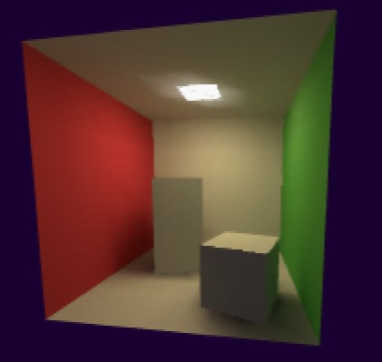
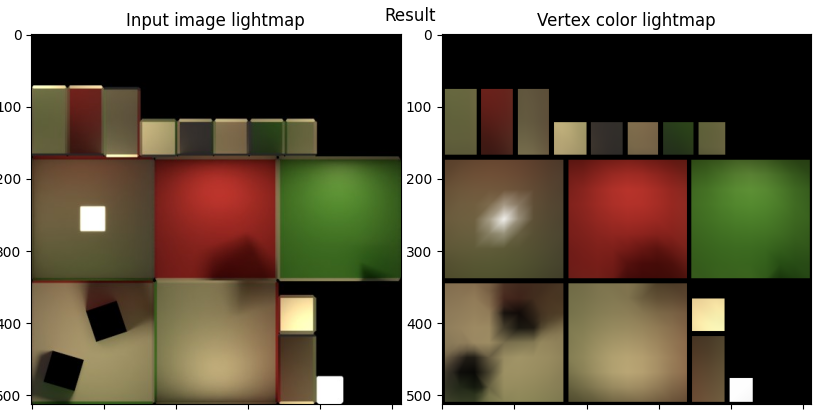

# ultrabaker

This is an experimental tool for baking 3D model lightmaps for the Nintendo 64. It takes in a GLTF model with a single lightmap texture and represents its colors using vertex colors. It doesn't work very well yet.

## Installation

At least python 3.9.9 is needed.

    python -m venv venv
    . venv/bin/activate      # activate environment on Linux
    # venv/Scripts/activate  # activate environment on Windows
    pip install -r requirements.txt

## Run the example

    python baker.py examples/cornellbox/cornellbox_tessellated.gltf --show

This is what you should see.

## How to bake and export a model from Blender

See [the baking guide](docs/blender_baking_guide.md).

## Loading a model in code

You can use any GLTF loader (in theory) or [this simple binary model loader](https://github.com/kannoneer/libdragon/blob/6fdf6aa2272ecacadca536ac20a83153859a5f69/examples/gldemo/gldemo.c#L72) that only supports per-vertex position + RGBA colors.

## Known issues

- Only a single UV map is supported
- Very slow on lightmaps larger than 1024x1024
- Mesh needs to be in a single "GLTF primitive". Use a single material for everything.
- Smoothing value behaves weirdly
- If mesh has normals, Blender's GLTF export often duplicates vertices, leading to a faceted look.
    - So make sure you export with Normals: Off

## Learn more

Based on the 2011 [Least Squares Vertex Baking paper](https://cal.cs.umbc.edu/Papers/Kavan-2011-LSV/) by L. Kavan, A.W. Bargteil, P.-P. Sloan.

## License

MIT