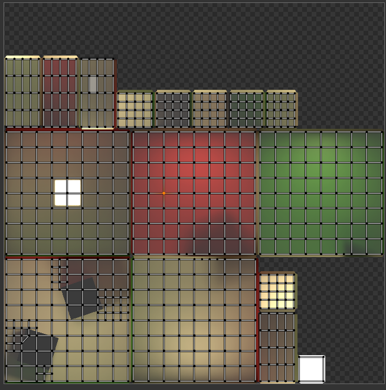
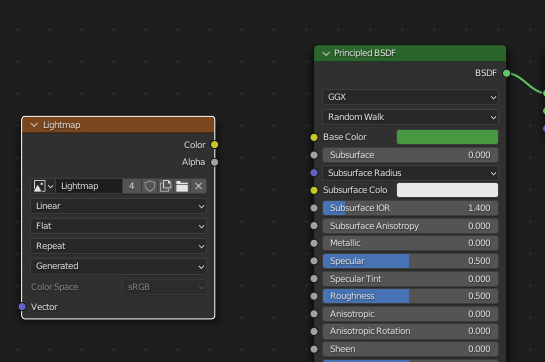
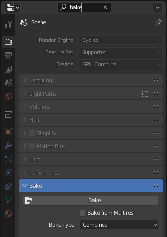
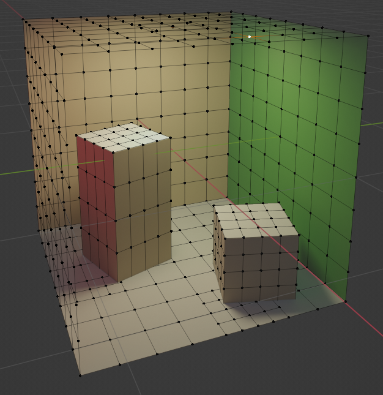
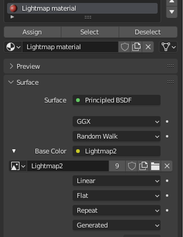
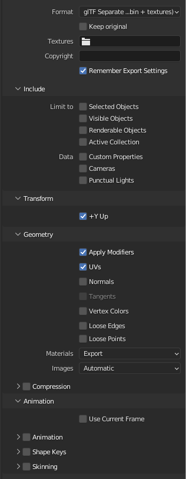
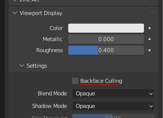
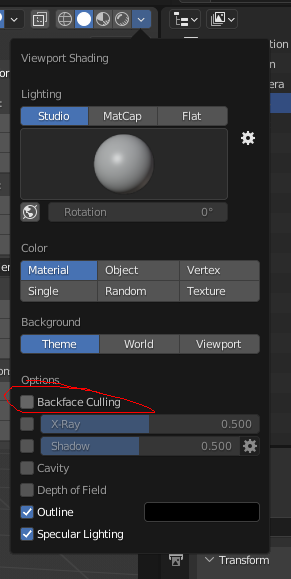

# Blender lightmap to GLTF baking guide

## Baking lighting to textures

There may be an easier way but this is how I've done it.

1. Merge all your objects to a single object (select all and **Join**)
2. Create a 1024x1024 empty image. Let's call it *Lightmap*.
3. Create a UV map with **Smart UV Project** (press U in edit mode)
    - **Margin:** 0.05 worked OK for me.
    
4. For all materials you wish to bake, add an unused **Image Texture** node and choose *Lightmap* from the menu:

5. From the **Render Properties** tab, find the **Bake** button.
    - 
    - If it's super slow, lower **Max Samples** to 32 for example under the **Sampling** section.

Make sure your model has enough vertices to represent the baked lighting by subdividing it a few times in edit mode:

## GLTF export

1. For export, add your new *Lightmap* texture as the **Base Color** for one material. Do it by clicking that yellow dot on the left of the RGB picker.
    - 
2. Assign that material to all faces you are going to export. This makes them a single "GLTF primitive".
3. Export a GLTF.

### GLTF export settings

**Format:** *glTF Separate (.gltf + .bin + textures)*.
Disable **Normals** and **Vertex Colors** export.

 Normals cause discontinuities and vertex colors are written by the baker so they are not welcome in the input mesh.

## How to enable backface culling

The GLTF exporter uses a per-material setting to decide if surfaces or one or two-sided. You usually want all to be one-sided so please enable backface culling for exported materials.

In Cycles materials under **Viewport Info**:

In Eevee materials under **Settings**:

### Viewport backface culling

To check if your triangles are pointing the right direction, enable viewport backface culling under the **Viewport Shading** menu:

